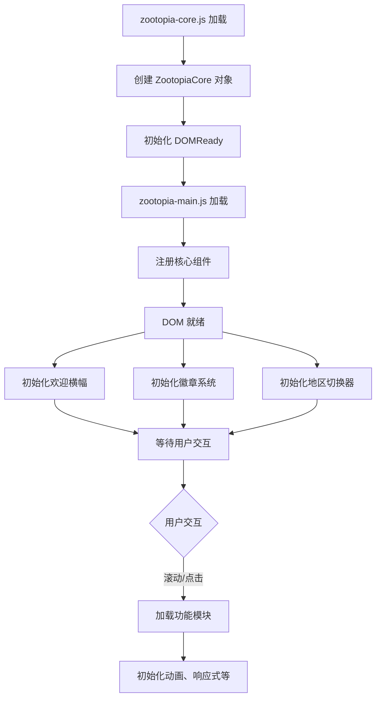

# 疯狂动物城 v2.1 开发者指南

**版本**: v2.1.0
**更新日期**: 2026-04-10
**适用对象**: 主题开发者、前端工程师

---

## 目录

1. [系统架构](#系统架构)
2. [核心 API 参考](#核心-api-参考)
3. [组件开发指南](#组件开发指南)
4. [游戏开发指南](#游戏开发指南)
5. [性能优化指南](#性能优化指南)
6. [扩展开发](#扩展开发)
7. [故障排除](#故障排除)

---

## 系统架构

### 核心设计原则

疯狂动物城 v2.1 采用模块化架构，遵循以下设计原则：

1. **单一职责** - 每个模块只负责一个特定功能
2. **依赖注入** - 通过 `ZootopiaCore` 统一管理依赖
3. **懒加载** - 非关键功能按需加载
4. **事件委托** - 统一事件管理，减少监听器数量
5. **数据单例** - 共享数据统一存储

### 文件结构

```
source/js/
├── 核心层 (必需)
│   ├── zootopia-core.js          # 核心功能和工具
│   └── zootopia-main.js           # 主入口和初始化
│
├── 功能层 (按需加载)
│   ├── zootopia-components.js    # UI 组件
│   ├── zootopia-animations.js    # 动画系统
│   ├── zootopia-responsive.js    # 响应式系统
│   ├── zootopia-games-system.js  # 游戏系统
│   ├── zootopia-social-system.js # 社交系统
│   ├── zootopia-music-system.js  # 音乐系统
│   ├── zootopia-performance.js   # 性能监控
│   ├── zootopia-criticalpath.js  # 关键路径优化
│   └── zootopia-compatibility.js # 浏览器兼容
│
└── 样式层
    └── ../css/
        ├── zootopia-optimized.css    # 核心样式
        ├── zootopia-components.css   # 组件样式
        ├── zootopia-animations.css   # 动画样式
        ├── zootopia-games.css        # 游戏样式
        ├── zootopia-social.css       # 社交样式
        └── zootopia-music.css        # 音乐样式
```

### 初始化流程



---

## 核心 API 参考

### ZootopiaCore 对象

全局命名空间，包含所有核心功能。

```javascript
window.ZootopiaCore = {
  version: '2.1.0',           // 版本号
  loaded: true,               // 加载状态
  config: ZootopiaConfig,     // 配置对象
  characters: CharacterDatabase,  // 角色数据库
  districts: DistrictDatabase,    // 地区数据库
  utils: Utils,               // 工具函数
  events: EventManager,       // 事件管理器
  modules: ModuleManager,     // 模块管理器
  dom: DOMReady,              // DOM 就绪管理器
  animation: AnimationManager // 动画管理器
};
```

### 配置 API (ZootopiaCore.config)

```javascript
// 主题色配置
ZootopiaCore.config.colors = {
  primary: '#FF9F43',     // 金橙色
  secondary: '#0ABDE3',   // 冰蓝色
  accent: '#10AC84',      // 翠绿色
  danger: '#EE5A24',      // 警告色
  success: '#10AC84',     // 成功色
  warning: '#FF9F43'      // 警告色
};

// 动画配置
ZootopiaCore.config.animation = {
  fast: 150,      // 快速动画
  normal: 300,    // 普通动画
  slow: 500       // 慢速动画
};

// 性能配置
ZootopiaCore.config.performance = {
  maxConcurrentAnimations: 3,  // 最大并发动画数
  enableReducedMotion: true,   // 启用减少动画偏好
  lazyLoadThreshold: 200       // 懒加载阈值（ms）
};
```

### 工具函数 API (ZootopiaCore.utils)

```javascript
// 防抖 - 延迟执行函数
ZootopiaCore.utils.debounce(fn, delay);
// 示例：窗口大小改变时重新计算布局
window.addEventListener('resize',
  ZootopiaCore.utils.debounce(() => {
    recalculateLayout();
  }, 250)
);

// 节流 - 限制执行频率
ZootopiaCore.utils.throttle(fn, limit);
// 示例：滚动时更新位置（最多每100ms执行一次）
window.addEventListener('scroll',
  ZootopiaCore.utils.throttle(() => {
    updatePosition();
  }, 100)
);

// 随机数
ZootopiaCore.utils.random(min, max);
// 示例：获取 1-10 的随机数
const randomNum = ZootopiaCore.utils.random(1, 10);

// 创建元素
ZootopiaCore.utils.createElement(tag, className, content);
// 示例：创建一个按钮
const button = ZootopiaCore.utils.createElement('button', 'zt-btn', '点击我');

// 数组乱序
ZootopiaCore.utils.shuffle(array);
// 示例：随机打乱数组
const shuffled = ZootopiaCore.utils.shuffle([1, 2, 3, 4, 5]);
```

### 事件管理器 API (ZootopiaCore.events)

```javascript
// 添加事件监听
ZootopiaCore.events.on(element, event, handler, options);
// 示例：监听按钮点击
ZootopiaCore.events.on(button, 'click', (e) => {
  console.log('按钮被点击');
});

// 添加一次性事件
ZootopiaCore.events.once(element, event, handler);
// 示例：只执行一次的初始化
ZootopiaCore.events.once(element, 'click', initFunction);

// 移除事件监听
ZootopiaCore.events.off(element, event, handler);

// 事件委托
ZootopiaCore.events.delegate(parent, selector, event, handler);
// 示例：委托处理列表项点击
ZootopiaCore.events.delegate(list, 'li', 'click', (e) => {
  console.log('列表项被点击:', e.target);
});
```

### 模块管理器 API (ZootopiaCore.modules)

```javascript
// 注册模块
ZootopiaCore.modules.register(name, initFn, dependencies);
// 示例：注册一个依赖动画模块的组件
ZootopiaCore.modules.register('myComponent', () => {
  initMyComponent();
}, ['animation']);

// 加载模块
ZootopiaCore.modules.load(name);
// 示例：加载音乐模块
ZootopiaCore.modules.load('music').then(() => {
  console.log('音乐模块已加载');
});

// 批量加载
ZootopiaCore.modules.loadBatch(['games', 'social', 'music']);
```

### DOM 就绪 API (ZootopiaCore.dom)

```javascript
// DOM 加载完成后执行
ZootopiaCore.dom.then(callback);
// 示例：DOM 就绪后初始化组件
ZootopiaCore.dom.then(() => {
  initWelcomeBanner();
  initBadgeSystem();
});
```

### 动画管理器 API (ZootopiaCore.animation)

```javascript
// 执行单个动画
ZootopiaCore.animation.animate(element, type, options);
// 示例：淡入动画
ZootopiaCore.animation.animate(element, 'fadeIn', {
  duration: 500,
  delay: 100
});

// 批量动画
ZootopiaCore.animation.animateBatch(elements, type, delay);
// 示例：依次显示多个元素
ZootopiaCore.animation.animateBatch(items, 'slideUp', 100);

// 序列动画
ZootopiaCore.animation.animateSequence(element, types);
// 示例：执行动画序列
ZootopiaCore.animation.animateSequence(element, [
  'fadeIn',
  'scaleIn',
  'bounce'
]);
```

---

## 组件开发指南

### 角色数据库 API

```javascript
// 获取所有角色
const allCharacters = ZootopiaCore.characters.getAll();

// 根据ID获取角色
const judy = ZootopiaCore.characters.getById('judy');
// 返回: { id: 'judy', name: '朱迪·霍普斯', species: '兔子', ... }

// 根据物种获取角色
const rabbits = ZootopiaCore.characters.getBySpecies('兔子');
// 返回所有兔子角色

// 搜索角色
const results = ZootopiaCore.characters.search('朱迪');
// 返回名称或描述包含"朱迪"的角色

// 获取随机角色
const random = ZootopiaCore.characters.getRandom();
```

### 地区数据库 API

```javascript
// 获取所有地区
const allDistricts = ZootopiaCore.districts.getAll();

// 根据ID获取地区
const sahara = ZootopiaCore.districts.getById('sahara');
// 返回: { id: 'sahara', name: '撒哈拉广场', climate: '炎热', ... }

// 获取随机地区
const random = ZootopiaCore.districts.getRandom();
```

### UI 组件 API

#### 角色卡片

```javascript
// 创建角色卡片
const card = ZootopiaCore.components.CharacterCard.template('judy');
document.body.appendChild(card);

// 自定义卡片
const customCard = ZootopiaCore.components.CharacterCard.create({
  character: 'nick',
  showStats: true,
  interactive: true
});
```

#### 对话气泡

```javascript
// 显示对话气泡
ZootopiaCore.components.DialogueBubble.show(
  'judy',           // 角色ID
  'Try Everything!', // 消息内容
  container         // 容器元素
);

// 自定义气泡
ZootopiaCore.components.DialogueBubble.show('nick', '消息', {
  position: 'right',
  autoHide: 5000,
  animated: true
});
```

#### 徽章系统

```javascript
// 更新徽章数量
ZootopiaCore.components.BadgeSystem.update('pawpsicle', 10);

// 增加徽章
ZootopiaCore.components.BadgeSystem.increment('pawpsicle');

// 获取徽章数量
const count = ZootopiaCore.components.BadgeSystem.get('pawpsicle');
```

#### 天气组件

```javascript
// 显示天气
ZootopiaCore.components.WeatherWidget.show('sahara', container);
```

#### 任务板

```javascript
// 创建任务板
ZootopiaCore.components.TaskBoard.create(container);
```

---

## 游戏开发指南

### 游戏系统架构

所有游戏都继承自 `BaseGame` 类：

```javascript
class BaseGame {
  constructor(container) {
    this.container = container;
    this.score = 0;
    this.active = false;
  }

  // 必须实现的方法
  init() { }      // 初始化游戏
  start() { }     // 开始游戏
  stop() { }      // 停止游戏
  destroy() { }   // 销毁游戏

  // 可选方法
  pause() { }     // 暂停游戏
  resume() { }    // 继续游戏
  reset() { }     // 重置游戏
}
```

### 创建自定义游戏

```javascript
// 1. 定义游戏类
class MyCustomGame extends BaseGame {
  constructor(container) {
    super(container);
    this.gameName = '我的游戏';
  }

  init() {
    // 创建游戏UI
    this.createUI();
    // 绑定事件
    this.bindEvents();
  }

  start() {
    this.active = true;
    this.score = 0;
    // 开始游戏逻辑
  }

  stop() {
    this.active = false;
    // 停止游戏逻辑
    this.showResults();
  }

  destroy() {
    // 清理资源
    this.stop();
    this.container.innerHTML = '';
  }

  createUI() {
    // 创建游戏界面
  }

  bindEvents() {
    // 绑定事件监听器
  }
}

// 2. 注册游戏
ZootopiaCore.games.register('myGame', MyCustomGame);

// 3. 启动游戏
ZootopiaCore.games.startGame('myGame');
```

### 游戏管理器 API

```javascript
// 启动游戏
ZootopiaCore.games.startGame(gameId);

// 结束当前游戏
ZootopiaCore.games.endGame();

// 获取游戏统计
const stats = ZootopiaCore.games.getStats();

// 更新最高分
ZootopiaCore.games.updateHighScore(gameId, score);
```

---

## 性能优化指南

### 动画性能优化

```javascript
// 1. 使用 GPU 加速的属性
// ✅ 推荐：transform, opacity
element.style.transform = 'translateX(100px)';
element.style.opacity = '0.5';

// ❌ 避免：left, top, width, height
element.style.left = '100px';

// 2. 批量 DOM 操作
// ✅ 推荐：使用文档片段
const fragment = document.createDocumentFragment();
items.forEach(item => fragment.appendChild(item));
container.appendChild(fragment);

// ❌ 避免：多次插入
items.forEach(item => container.appendChild(item));

// 3. 限制并发动画
ZootopiaCore.config.performance.maxConcurrentAnimations = 3;
```

### 事件监听优化

```javascript
// 1. 使用事件委托
// ✅ 推荐
ZootopiaCore.events.delegate(list, 'li', 'click', handler);

// ❌ 避免
items.forEach(item => {
  item.addEventListener('click', handler);
});

// 2. 使用防抖/节流
// ✅ 推荐
window.addEventListener('scroll',
  ZootopiaCore.utils.throttle(onScroll, 100)
);

// ❌ 避免
window.addEventListener('scroll', onScroll);
```

### 资源加载优化

```javascript
// 1. 懒加载非关键资源
// ✅ 推荐：用户交互后加载
document.addEventListener('click', loadHeavyModule, { once: true });

// ❌ 避免：立即加载所有模块
loadAllModules();

// 2. 使用 IntersectionObserver
const observer = new IntersectionObserver((entries) => {
  entries.forEach(entry => {
    if (entry.isIntersecting) {
      loadImage(entry.target);
      observer.unobserve(entry.target);
    }
  });
});

// 3. 预加载关键资源
const link = document.createElement('link');
link.rel = 'preload';
link.href = '/css/zootopia-optimized.css';
link.as = 'style';
document.head.appendChild(link);
```

---

## 扩展开发

### 添加新的 UI 组件

```javascript
// 1. 创建组件文件
// source/js/zootopia-my-components.js

(function() {
  'use strict';

  const MyComponent = {
    create: function(options) {
      const element = document.createElement('div');
      element.className = 'zt-my-component';

      // 组件逻辑
      this.render(element, options);

      return element;
    },

    render: function(element, options) {
      // 渲染逻辑
    }
  };

  // 2. 导出组件
  ZootopiaCore.components.MyComponent = MyComponent;

  // 3. 自动初始化
  ZootopiaCore.dom.then(function() {
    const containers = document.querySelectorAll('[data-zt-my-component]');
    containers.forEach(container => {
      const component = MyComponent.create();
      container.appendChild(component);
    });
  });

})();
```

### 添加新的动画类型

```javascript
// 1. 定义动画关键帧（CSS）
@keyframes myCustomAnimation {
  0% {
    opacity: 0;
    transform: scale(0.5);
  }
  100% {
    opacity: 1;
    transform: scale(1);
  }
}

// 2. 注册动画
ZootopiaCore.animation.presets.myCustom = {
  keyframe: 'myCustomAnimation',
  duration: 500,
  easing: 'ease-out'
};

// 3. 使用动画
ZootopiaCore.animation.animate(element, 'myCustom');
```

### 添加新的主题颜色

```javascript
// 1. 在 _config.butterfly.yml 中配置
theme_color:
  enable: true
  main: "#FF9F43"
  my_custom_color: "#123456"

// 2. 在 CSS 中使用变量
.zt-my-element {
  background: var(--zt-my-custom-color);
}

// 3. 在 JavaScript 中访问
const color = getComputedStyle(document.documentElement)
  .getPropertyValue('--zt-my-custom-color');
```

---

## 故障排除

### 常见问题

**Q: 游戏无法启动？**

A: 检查以下几点：
1. 确认 `zootopia-games-system.js` 已加载
2. 检查游戏容器是否存在
3. 查看浏览器控制台是否有错误

```javascript
// 调试代码
console.log('游戏系统:', ZootopiaCore.games);
console.log('容器:', document.querySelector('.zt-game-container'));
```

**Q: 动画不流畅？**

A: 可能的原因和解决方案：
1. 并发动画过多 - 减少 `maxConcurrentAnimations`
2. 使用了不当的 CSS 属性 - 改用 `transform` 和 `opacity`
3. 设备性能较低 - 检测并降级

```javascript
// 启用减少动画
if (window.matchMedia('(prefers-reduced-motion: reduce)').matches) {
  ZootopiaCore.config.animation.fast = 0;
  ZootopiaCore.config.animation.normal = 0;
  ZootopiaCore.config.animation.slow = 0;
}
```

**Q: 本地存储数据丢失？**

A: 检查以下几点：
1. 浏览器是否禁用了本地存储
2. 是否在隐私模式下浏览
3. 存储空间是否已满

```javascript
// 检测本地存储可用性
function isStorageAvailable() {
  try {
    const test = '__storage_test__';
    localStorage.setItem(test, test);
    localStorage.removeItem(test);
    return true;
  } catch (e) {
    return false;
  }
}
```

### 调试模式

```javascript
// 启用调试日志
localStorage.setItem('zt_debug', 'true');

// 查看核心对象
console.log('ZootopiaCore:', ZootopiaCore);

// 查看所有已加载模块
console.log('已加载模块:', ZootopiaCore.modules.loadedModules);

// 查看性能统计
if (ZootopiaCore.performance) {
  console.log('性能报告:', ZootopiaCore.performance.getReport());
}
```

### 性能分析

```javascript
// 获取性能报告
const report = window.ztGetPerformanceReport();
console.log(report);

// 显示性能监控面板
window.ztShowPerformanceWidget();

// 检查浏览器兼容性
const compat = window.ztCheckCompatibility();
console.log(compat);
```

---

## 最佳实践

### 1. 命名规范

```javascript
// 组件名称：PascalCase
MyComponent, CharacterCard, DialogueBubble

// 函数名称：camelCase
createCard, updateBadge, showWeather

// 常量：UPPER_SNAKE_CASE
MAX_SCORE, DEFAULT_DURATION, API_KEY

// CSS 类：zt- 前缀
.zt-card, .zt-button, .zt-container

// 数据属性：data-zt- 前缀
data-zt-character, data-zt-animate
```

### 2. 代码组织

```javascript
// ✅ 推荐：使用 IIFE 封装模块
(function() {
  'use strict';

  // 私有变量和函数
  const privateVar = 'private';

  function privateFunction() { }

  // 公共 API
  const PublicAPI = {
    method1: function() { },
    method2: function() { }
  };

  // 导出到全局
  ZootopiaCore.myModule = PublicAPI;

})();
```

### 3. 错误处理

```javascript
// ✅ 推荐：使用 try-catch
try {
  const data = JSON.parse(jsonString);
} catch (e) {
  console.error('解析失败:', e);
  // 提供降级方案
}

// ✅ 推荐：检查 API 可用性
if ('IntersectionObserver' in window) {
  const observer = new IntersectionObserver(callback);
} else {
  // 提供降级方案
  console.warn('IntersectionObserver 不支持');
}
```

### 4. 内存管理

```javascript
// ✅ 推荐：及时清理资源
class MyComponent {
  constructor() {
    this.handlers = [];
  }

  init() {
    const handler = () => { };
    element.addEventListener('click', handler);
    this.handlers.push({ element, event: 'click', handler });
  }

  destroy() {
    // 移除所有事件监听器
    this.handlers.forEach(({ element, event, handler }) => {
      element.removeEventListener(event, handler);
    });
    this.handlers = [];
  }
}
```

---

## 附录

### 快捷键列表

| 快捷键 | 功能 |
|-------|------|
| `Ctrl + Shift + P` | 显示/隐藏性能监控面板 |
| `Ctrl + Shift + D` | 显示/隐藏调试信息 |

### 全局函数列表

```javascript
// 性能相关
window.ztGetPerformanceReport()   // 获取性能报告
window.ztShowPerformanceWidget()  // 显示性能监控
window.ztEnableMonitoring()       // 启用监控

// 兼容性相关
window.ztCheckCompatibility()     // 检查浏览器兼容性
window.ztGetBrowserInfo()         // 获取浏览器信息

// 模块加载
window.ztLoadGames()             // 加载游戏模块
window.ztLoadSocial()            // 加载社交模块
window.ztLoadMusic()             // 加载音乐模块

// 音乐控制
window.ztMusic                   // 音乐播放器快捷方式

// 动画
window.ztAnimate(element, type)  // 执行动画
window.ztParticles(x, y, count)  // 创建粒子效果

// 响应式
window.ztIsMobile()              // 检测是否移动设备
window.ztGetBreakpoint()         // 获取当前断点
window.ztGetOrientation()        // 获取屏幕方向
```

### 本地存储键列表

| 键名 | 用途 |
|-----|------|
| `zt_gameStats` | 游戏统计数据 |
| `zt_pawpsicles` | Pawpsicle 收集数 |
| `zt_emojiReactions` | 表情反应数据 |
| `zt_comments` | 评论数据 |
| `zt_musicVolume` | 音乐音量 |
| `zt_musicMode` | 播放模式 |
| `zt_highScores` | 游戏最高分 |
| `zt_debug` | 调试模式开关 |

---

**文档版本**: v2.1.0
**最后更新**: 2026-04-10

如有疑问，请参考：
- [ZOOTOPIA-V2-USAGE.md](ZOOTOPIA-V2-USAGE.md) - 使用指南
- [FINAL-OPTIMIZATION-REPORT.md](FINAL-OPTIMIZATION-REPORT.md) - 优化报告
- [CLAUDE.md](CLAUDE.md) - 项目文档
